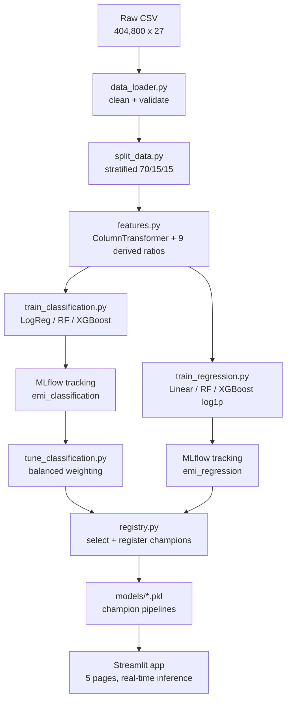

# EMIPredict AI — Technical Documentation

**Project:** Intelligent Financial Risk Assessment Platform
**Domain:** FinTech / Banking
**Stack:** Python · pandas · scikit-learn · XGBoost · MLflow · Streamlit

---

## 1. Overview

EMIPredict AI solves two linked lending problems from a single applicant profile:

| Task | Type | Target | Grading goal | Achieved |
|---|---|---|---|---|
| EMI eligibility | 3-class classification | `emi_eligibility` | accuracy > 90% | **94.5%** (0.93 High-Risk recall) |
| Maximum safe EMI | regression | `max_monthly_emi` | RMSE < ₹2000 | **RMSE ₹705**, R² 0.99 |

Both models share one preprocessing pipeline and are served through a multi-page
Streamlit application with MLflow experiment tracking and a model registry.

---

## 2. Architecture



**Layers**
- **Data layer** — raw CSV → cleaned frame → deterministic splits.
- **Processing layer** — a single serializable sklearn `Pipeline` (feature
  engineering + imputation + encoding + scaling).
- **Model layer** — classification & regression estimators, tracked in MLflow,
  selected into a versioned registry.
- **Application layer** — Streamlit multi-page app loading the champion pipelines.
- **Deployment layer** — Streamlit Community Cloud from GitHub.

---

## 3. Data loading & cleaning (`src/data_loader.py`)

Real data profiled on 2026-08-26: **404,800 rows × 27 columns** (25 features +
2 targets), no duplicate rows, ~0.6% nulls in five columns.

Cleaning steps applied (data diverged from the brief in these ways):
1. **Corrupted numeric strings** — `age`, `monthly_salary`, `bank_balance` were
   stored as text with doubled decimal suffixes (`"58.0.0"`, `"64300.0.0.0"`).
   A regex extracts the first valid float and casts to numeric.
2. **Inconsistent categories** — `gender` had 8 variants (`Male/MALE/M/male`, …)
   normalised to `Male` / `Female`.
3. **Whitespace** trimmed on categorical fields; dtypes enforced.

A **data-quality report** (`reports/data_quality.md`) records nulls, class
balance, out-of-range counts, and per-scenario bound violations.

---

## 4. Train / validation / test split (`src/split_data.py`)

Deterministic **70 / 15 / 15** split, **stratified on `emi_eligibility`**
(`random_state=42`). The same split feeds both tasks so results are comparable.
Class proportions are preserved exactly across all three splits
(Not_Eligible 77.3% / Eligible 18.4% / High_Risk 4.3%).

---

## 5. Feature engineering (`src/features.py`)

A single `Pipeline` guarantees identical transforms at train and serve time
(no training/serving skew). It is stored *with* the model.

**9 derived ratios** (see `reports/feature_dictionary.md`):
`total_monthly_expenses`, `disposable_income`, `expense_to_income`,
`debt_to_income`, `requested_to_income`, `requested_to_balance`,
`emergency_fund_months`, `affordability`, and a composite `risk_score`
(blend of normalised credit risk, employment stability, and debt burden).

**Preprocessing** (`ColumnTransformer`):
- numeric (raw + derived): median impute → `StandardScaler`
- categorical: most-frequent impute → `OneHotEncoder(handle_unknown="ignore")`
- ordinal (`education`): most-frequent impute → `OrdinalEncoder` → scale

Output: a dense 49-column numeric matrix.

---

## 6. Modelling

### 6.1 Classification (`src/train_classification.py`)
Three models, all class-weighted for the severe imbalance:
LogisticRegression, RandomForest, XGBoost. Metrics logged: accuracy, macro-F1,
per-class recall, ROC-AUC (OvR).

### 6.2 Regression (`src/train_regression.py`)
Three models predicting **`log1p(max_monthly_emi)`** via
`TransformedTargetRegressor` (the target is right-skewed with 26% of rows on the
₹500 floor). Metrics reported on back-transformed ₹: RMSE, MAE, R², MAPE.

### 6.3 Tuning (`src/tune_classification.py`)
`balanced` sample weighting lifted High-Risk recall from **0.54 → 0.93** while
holding **94.5%** accuracy — the key selection trade-off (see §7).

Full results: `reports/classification_results.csv`,
`reports/regression_results.csv`, `reports/classification_tuning.csv`.

---

## 7. Model selection & MLflow (`src/registry.py`)

All runs are tracked in MLflow (SQLite backend) across two experiments —
`emi_classification` and `emi_regression`. Selection rationale and the full
comparison table are in `reports/model_selection.md`.

**Champions** (registered with the `champion` alias, exported to `models/`):

| Registry name | Model | Why |
|---|---|---|
| `emi_eligibility_clf` | XGBoost (balanced) | Highest High-Risk recall (0.93) above the 0.93-accuracy floor — missing a risky applicant is the costly error in lending |
| `emi_max_emi_reg` | XGBoost (log1p) | Lowest RMSE (₹705), R² 0.99 |

Because accuracy is misleading under 77% imbalance, selection led with **macro-F1
and per-class recall**, not raw accuracy.

Browse runs locally:
```bash
mlflow ui --backend-store-uri sqlite:///mlflow.db
```

---

## 8. Application (`app/`)

Multi-page Streamlit app loading the champion pipelines via cached `joblib`:

| Page | Purpose |
|---|---|
| Home | Overview, KPIs, quick-launch tools |
| Predict Eligibility | Class + probabilities, **risk gauge**, **explainable key factors**, safe-EMI-vs-requested recommendation |
| Predict Max EMI | Safe monthly EMI + affordability comparison |
| Data Explorer | Filters, distributions, per-scenario breakdowns |
| Model Dashboard | Model comparison + MLflow-tracked metrics |
| Admin CRUD | SQLite create/read/update/delete of applicant records |

UX features: one-click example applicants, animated SVG iconography (reduced-
motion aware), and plain-language interpretation of every result. The app applies
the exact training pipeline at inference (no serving skew).

---

## 9. Deployment

- Push to GitHub → deploy on **Streamlit Community Cloud** with main file
  `app/Home.py`, Python 3.12.
- `requirements.txt` is **lean** (app runtime only) and pinned to the versions the
  committed pickles were built with; `requirements-dev.txt` adds MLflow/plotting
  for training. This keeps the cloud build small and reproducible.
- Small committed champion models + a 5K-row `data/sample.csv` make the app
  self-contained on the cloud; the SQLite CRUD store self-initialises.

---

## 10. Reproducing the pipeline

```bash
pip install -r requirements-dev.txt
python -m src.data_loader        # cleaning + data_quality.md
python -m src.split_data         # train/val/test splits
python -m src.eda                # EDA report + plots
python -m src.train_classification
python -m src.train_regression
python -m src.tune_classification
python -m src.registry           # select + register + export champions
python -m streamlit run app/Home.py
```

Determinism: `random_state=42` throughout; splits and model fits are reproducible.
