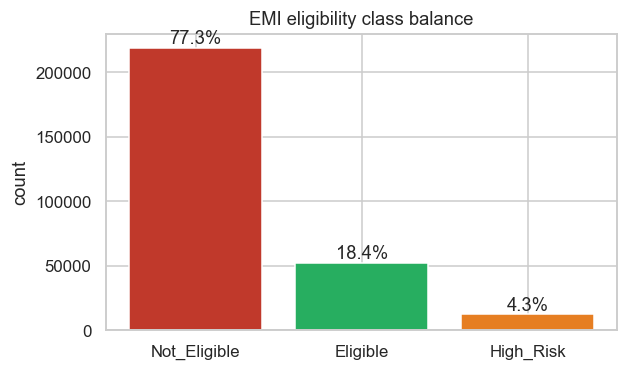
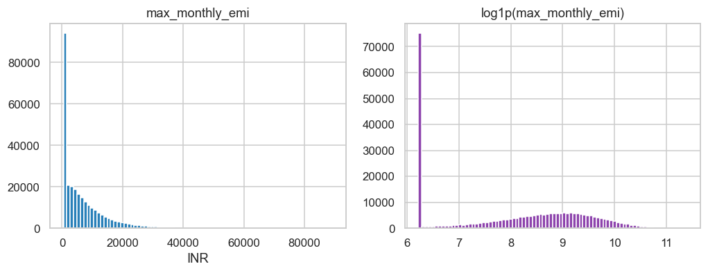
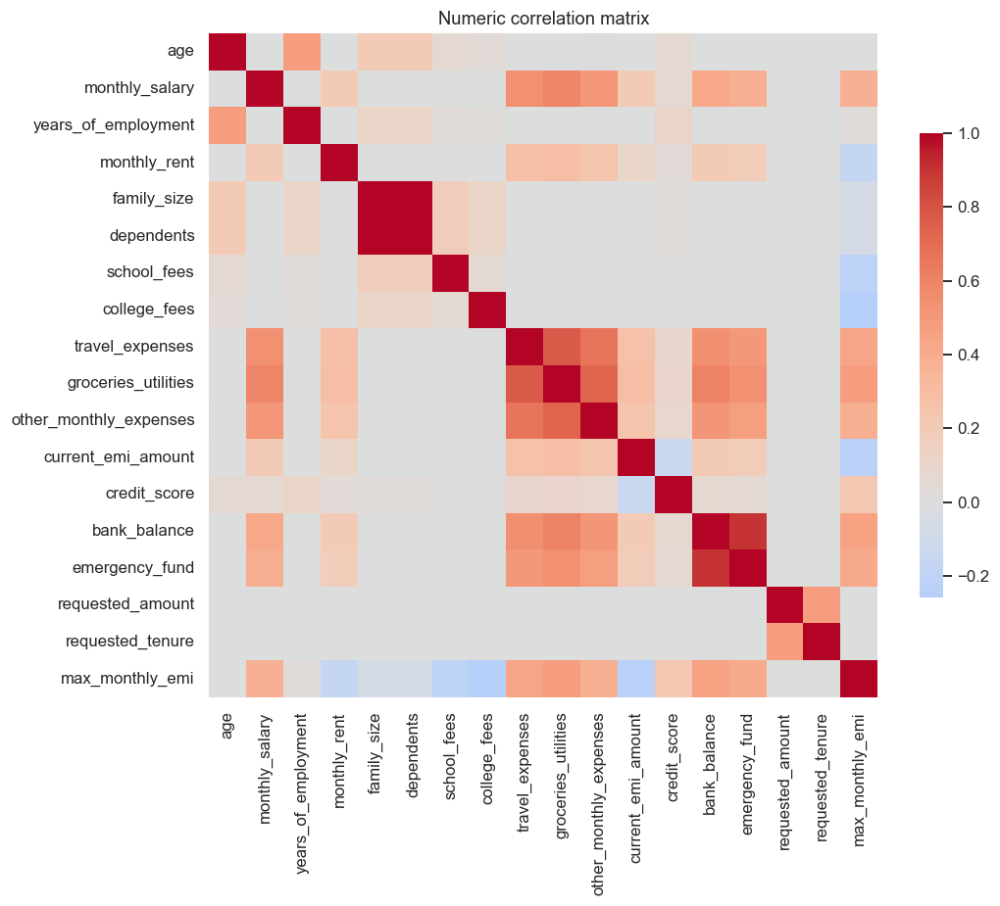

# Exploratory Data Analysis

_Computed on the train split (n=283,359)._

## 1. Class imbalance (drives metric choice)

| Class | Share |
|---|---|
| Not_Eligible | 77.29% |
| Eligible | 18.39% |
| High_Risk | 4.32% |

**Insight:** Not_Eligible dominates (~77%). A trivial majority-class predictor already scores ~77% accuracy, so **accuracy is a weak metric here**. Report **macro-F1 and per-class recall** (especially for High_Risk at ~4%). Use stratified splits + class weighting.

## 2. Regression target: `max_monthly_emi`

- Range **500–89,166 INR**, mean 6,757, median 4,204, std 7,726.
- **26.3%** of rows sit on the **500 floor** (clipped low end).
- Strong right skew -> the log transform is far more symmetric. **Recommend modeling `log1p(max_monthly_emi)`** and back-transforming.
- RMSE target <2000 is tight vs std ~7,726.

## 3. Numeric drivers of `max_monthly_emi`

Top correlations with the regression target:

| Feature | corr |
|---|---|
| groceries_utilities | +0.483 |
| bank_balance | +0.458 |
| travel_expenses | +0.441 |
| emergency_fund | +0.415 |
| other_monthly_expenses | +0.382 |
| monthly_salary | +0.378 |
| college_fees | -0.258 |
| current_emi_amount | -0.242 |

## 4. Financial profile by eligibility class (mean)

| Class | credit_score | monthly_salary | current_emi_amount | requested_amount | emergency_fund | bank_balance |
|---|---|---|---|---|---|---|
| Not_Eligible | 694 | 54,267 | 5,147 | 427,787 | 86,347 | 215,567 |
| Eligible | 726 | 78,837 | 2,408 | 155,303 | 135,331 | 338,207 |
| High_Risk | 716 | 70,214 | 3,091 | 259,462 | 118,566 | 294,539 |

**Insight:** Eligible applicants have markedly higher credit_score and salary and lower existing EMI burden — consistent with the affordability logic behind the target.

## 5. Per-scenario breakdown

| Scenario | n | Eligible % | mean max_emi | mean requested |
|---|---|---|---|---|
| Vehicle EMI | 56,710 | 10.6% | 6,761 | 788,514 |
| Personal Loan EMI | 56,491 | 11.3% | 6,725 | 524,268 |
| Education EMI | 56,699 | 17.7% | 6,736 | 275,203 |
| Home Appliances EMI | 56,852 | 26.0% | 6,757 | 159,666 |
| E-commerce Shopping EMI | 56,607 | 26.3% | 6,807 | 104,995 |

**Insight:** high-ticket scenarios (Vehicle, Personal Loan) carry larger requested amounts; eligibility rates vary by scenario, so `emi_scenario` is an informative categorical feature.
